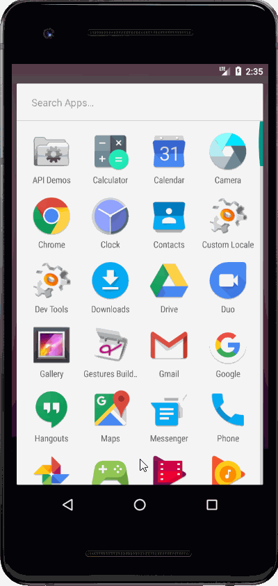

# SimpleToDo
Simple ToDo app for Codepath Prework

# Project 1 - SimpleToDo

SimpleToDo is an android app that allows building a todo list and basic todo items management functionality including adding new items, editing and deleting an existing item.

Submitted by: Todd Rosenkrantz

Time spent: 6 hours spent in total

## User Stories

The following **required** functionality is completed:

* [X] User can **view a list of todo items**
* [X] User can **successfully add and remove items** from the todo list
* [X] User's **list of items persisted** upon modification and and retrieved properly on app restart

The following **optional** features are implemented:

* [X] User can **tap a todo item in the list and bring up an edit screen for the todo item** and then have any changes to the text reflected in the todo list

The following **additional** features are implemented:

* [ ] List anything else that you can get done to improve the app functionality!

## Video Walkthrough

Here's a walkthrough of implemented user stories:

GIF created with [LiceCap](http://www.cockos.com/licecap/).

## Notes

Issues:
    issues with gradle ONLY working with Java 1.8 or less.  
    commons-i0 version must include trailing .0 such that 2.8 must be 2.8.0
    Error in Android Studio if teh following line is not included in the function, onActivityResult :
         super.onActivityResult(requestCode, resultCode, data);
    Slight variations between Android Studio used in demo and most recent, stable version.
    Connecting to GitHub for VCS required generation of API token to work with Android Studio (probably caused by Android Studio update).

## License

    Copyright [2020] [Todd Rosenkrantz]

    Licensed under the Apache License, Version 2.0 (the "License");
    you may not use this file except in compliance with the License.
    You may obtain a copy of the License at

        http://www.apache.org/licenses/LICENSE-2.0

    Unless required by applicable law or agreed to in writing, software
    distributed under the License is distributed on an "AS IS" BASIS,
    WITHOUT WARRANTIES OR CONDITIONS OF ANY KIND, either express or implied.
    See the License for the specific language governing permissions and
    limitations under the License.
